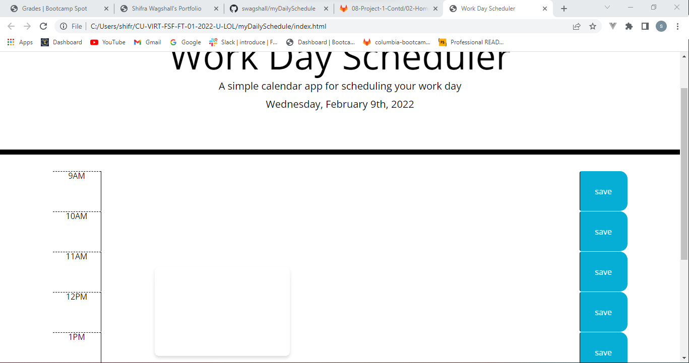

# myDailySchedule
This website is a daily schedual. It allows the user to enter data into the schedual and save it. The schedual is color coded, if the hour past it is in grey, the current hour is in red and the upcoming hours are in green.

# Technologies Used
HTML, CSS, JavaScript

# License
MIT

# Link
 Here is a link to the depolyed app: https://swagshall.github.io/myDailySchedule/

 # Contact 
For any questions or comments I can be reached via GitHub or email
GitHub: https://github.com/swagshall
Email: wagshallshifra@gmail.com

# Screenshots

Here is a screenshot of the website. 

